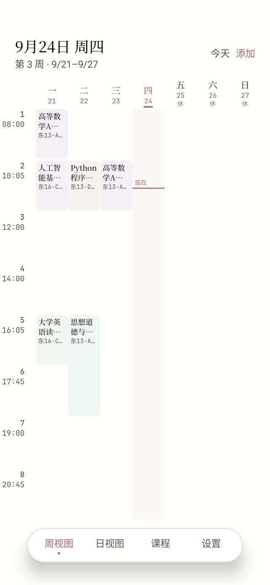
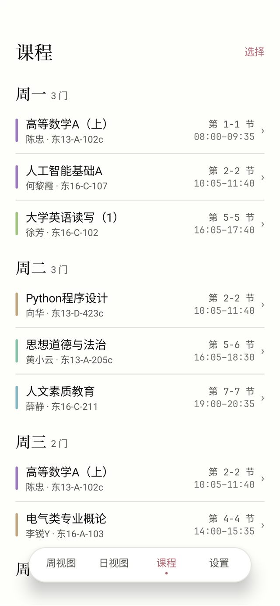
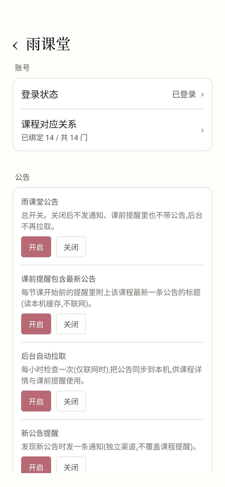
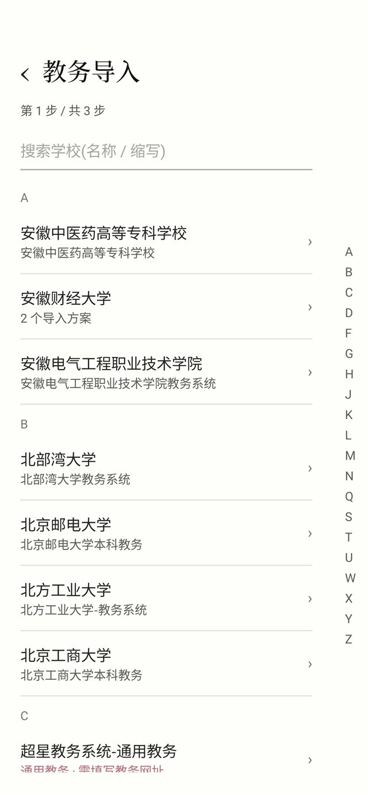

# 余课 · 极简课程表


> 给国内大学生用的 Android 课程表。
>
> 打开就是一整周——横看七天、竖看节次,不用翻页;四种方式把课表弄进来,课前提醒准点又不吵,
> 桌面小组件让你连应用都不必打开。
>
> 界面只留必要的东西:一抹强调色、三档中性,其余全交给白。

课表 App 大多喜欢把功能堆在脸上——开屏广告、签到、活动、横着滚的时间轴。我只想要一张能一眼看完的
课表,没找到顺手的,索性自己写了一个。这也是「余课」这名字的来头:该留白的地方,就留白。

## 界面

| 课表 | 课程 | 雨课堂公告 | 教务导入 |
| :---: | :---: | :---: | :---: |
|  |  |  |  |

## 它能帮上什么

- **一屏看全一周,也能只看一天**。默认横着是周一到周日七列、竖着是当天所有节次,不用来回翻页;右上角一切就换成「一天一页」的日视图,左右滑动翻天,「今天」一键回到当下。表头左上角常驻当前天气。
- **要交的、要考的也记上**。「日程」页一份数据两种看法:日历周条(带农历与节气)配按天的时间线,或者按「还剩几天」排的倒计时;新建一条只要填标题、分类、时间和优先级。
- **四种导入方式,挑顺手的用**。教务系统一键导入、手动添加单门课、粘贴表格或导入 Excel、拍张课表截图交给 AI 识别——都在课表右上角的「添加」里。
- **提醒准点,但不吵**。每节课开始前提醒(准点 / 5 / 10 / 15 / 30 / 60 分钟任选);也可以开着「实时活动」,让它在课前到下课之间一直告诉你还剩多久。
- **一眼认出是哪门课**。每门课有一层极淡的专属色,扫一眼就知道;此刻正在上的那节会额外被标出来。
- **桌面小组件**。今日课表 / 明日课程 / 下节课三块,不必打开应用就能看。
- **雨课堂公告**。登录雨课堂后,课程详情页按时间列出该课公告,课前提醒里也会带上最新一条;新公告单独通知一次(要先登录,也能在设置里整体关掉)。
- **9 张图标任选**。桌面上那个蓝发角色有 9 种表情,喜欢哪张点哪张;也可以打开轮播让它自己换。
- **不注册也能用**。课表默认只存在你自己的手机上;需要换机或备份时,再登录账号同步。

## 设计取向

应用遵循 **Yohaku(余白)** 的取向——把课表当纸看,不把界面当装饰:

- **一抹强调色**。全局只有一个强调色(默认梅色,另有縹 / 若竹 / 朽葉 / 蘇芳 / 空色 5 色可选),只用在「此刻正在上」与选中态这类真正需要抢眼的地方。
- **三档中性**。深浅两套暖纸面色板,层次靠明度,而不是靠颜色堆叠。
- **课程淡彩**。每门课有一层淡彩底,方便扫读;它不承载语义,课程名始终写在上面。色相在新建 / 导入时就分配好并钉在课程上——不同课程不会分到同一个颜色,之后增删课程也不会让已有课程变色,同一门课在哪天都是同一个颜色。档位可在「设置 → 课表 → 课表显示 → 配色方案」里选(柔和 / 标准 / 丰富),或点「重新配色全部课程」按当前方案重排一遍;也可以在某门课的编辑页指定颜色。
- **余者尽留为白**。没有课的位置什么都不画——留白本身就是「这里没课」。
- **衬线纸感**。内置思源宋体与等宽字体,时间与节次对齐得像表格一样整齐。

## 功能细节

### 课表

- **周视图**:七列一周,纵向按节次等高等分。行高会按屏幕高度自动算,装不下时可以整格上下滚动;左侧只留很窄一列放节号和每一节的起始时间。今天那一列会画一条当前时间线。
- **日视图**:同一页右上角切到「日」即可,一天一页、左右滑动翻天;卡片式列表,卡片之间的距离就是空堂;每 30 秒刷新「正在上课 · 还有 N 分钟下课 / 距下一节还有 N 分钟」。
- **当前天气**:表头左上角常驻一个天气图标 + 温度;点一下弹出完整天气卡——大号温度与天气现象,配体感、湿度、风力、空气质量、紫外线,右侧是定位到的区县与今日最高最低温;按出口 IP 定位(不申请定位权限),点一下可手动刷新。
- **课程块自定义**:「设置 → 课表 → 课表显示」里可以选显示哪些内容(时刻 / 节次 / 地点 / 教师)、行高密度(宽松 / 标准 / 紧凑)、课程名行数与字号、圆角与是否铺课程淡彩底。
- **课程页**:按星期分组列出全部课程,每条左边是课程色标、右边是「第几节 + 具体几点」;顶栏「选择」进入多选,可批量删除。
- **课程详情**:节次、具体时间、周次模式(每周 / 单周 / 双周 / 自定义)、教师、地点、备注,以及本学期每次课的具体日期。
- **课程编辑**:整页表单,星期可多选(一周多天上课),节次与周次点选即可(自定义周次可以逐周勾选);时间支持「按节次」和「自定义时间」两种模式,后者适合晚间讲座、临时加课。

### 日程

- **议程**:顶部一条日历周条(每天显示星期、日号与**农历 / 节气 / 节日**),点任意一天看那天的安排;下面按「全天 / 上午 / 下午 / 晚上」分段列出条目,每条给出起止时刻、分类与地点。
- **倒计时**:右上角切到「倒计时」,同一条目换成按「还剩几天」排序的列表;已结束的折叠在后面(标「逾期 N 天」)。
- **新建 / 编辑**:标题、分类(待办 / 活动 / 考试 / 作业 / 其他)、全天开关、开始与结束时间、地点、备注、优先级。全天条目在时间线里置顶。
- **同步**:日程与课表一样,**不登录就只存本机**,登录后跟着账号同步(删除也会同步,不会在别的设备上复活)。
- 说明:当前版本日程不做「到点提醒」,提醒仍只针对课程。

### 导入

- **教务系统导入**:选择你的学校,阅读适配说明后确认导入。用学校账号在应用内登录(账号密码只在这一次登录会话里使用),脚本会把课程、作息时间与开学日期读出来,再让你确认是否覆盖本地设置。课程会按单双周 / 自定义周次自动归类。
- **手动添加**:自己填一门课,适合补录或临时调整。
- **手动表格导入**:粘贴 CSV / TSV,或直接选 Excel 文件。自动识别表头与中文编码;第 8、9 列可以填开始 / 结束时间,生成自定义时间课程。
- **AI 图片导入**:支持 Google Gemini 或任意 OpenAI 兼容服务(DeepSeek、通义千问、Kimi、智谱 GLM 等)。在设置里填好自己的密钥后,上传课表截图即可识别课程与作息。

### 提醒

- **课前提醒**:可设置提前量,通知内容在触发那一刻才算(课程名、剩余分钟、开始时间、地点、教师),点击直达课程详情。
- **实时活动**:提醒形态可选。开启后,从提前量的那一刻起常驻一条通知,按分钟推进「还有 N 分钟上课 → 上课中 → 还有 N 分钟下课」,下课自动收起;通知上可以直接「取消本节课提醒」,这一节就不会再打扰你。在支持胶囊的机型上(荣耀灵动胶囊、小米超级岛、OPPO 实况通知等)会显示为状态栏胶囊与锁屏实时活动。
- **明日课程预告**:可选,在前一天你指定的时间提醒「明天有 N 门课 · 第一节几点、在哪」。
- **上课免打扰**:上课自动把手机切进免打扰、下课退回;连着上的课算作一段,中途不退出,也不会替你关掉自己开的免打扰。需要系统里的「勿扰访问权限」,「设置 → 提醒 → 上课免打扰」里可以直接授权。
- **可靠性**:设置里有「提醒可靠性」页,会识别你的手机品牌,一步步引导打开通知、精确闹钟、电池白名单与自启动——国产系统上这一步是提醒能否准时的关键。Android 16 及以上还会多一项「实时活动胶囊」,用来查看并打开系统的实时活动开关(胶囊不出现时先看这里)。应用还会定期自检并把提醒补排回来。

### 雨课堂公告

- **登录**:「设置 → 雨课堂 → 雨课堂公告」里内嵌雨课堂网页登录(扫码或账号密码皆可),登录态加密存在本机,不上传。登录通常两周左右过期,过期后重登一次即可,已配好的课程对应关系不用再改。
- **课程对应**:登录后按课名(必要时加教师)自动把课表里的课对应到雨课堂班级;同名课命中多个班级时会列出候选让你确认,也可以手动改选或取消。
- **公告时间轴**:课程详情页按时间倒序列出该课全部公告。
- **课前提醒带公告**:每节课开始前的提醒里附上该课程最新一条公告标题;只读本机缓存,不在触发那一刻联网,所以离线也准点。标准提醒与「实时活动」都会带。
- **新公告提醒**:后台每小时(仅联网时)同步一次,有新公告时另发一条通知,点击直达雨课堂设置页。**雨课堂自己发的「上课提醒 / 开始签到」不会推**——课表本来就有课前提醒,重复喊一遍没有意义(它们仍会出现在公告时间轴里)。第一次同步某个班级时把已有公告当基线,不会把历史公告当「新公告」推送。
- **可整体关闭**:「设置 → 雨课堂 → 雨课堂公告」里有总开关,以及「课前提醒包含最新公告」「后台自动拉取」「新公告提醒」三个分开关,另有「立即刷新公告」。默认全开——没登录时它们本来就是空转的。拉取失败的原因会写在日志里(logcat tag `YuketangSync`),也可以在「高级 → 公告接口」里手动指定接口路径。

### 桌面小组件

- **今日课表**(4×2):今天的课程列表,正在上的那节会被标出。
- **明日课程**(2×2):今天就能看到明天要上什么,不必等到第二天。
- **下节课**(1×1):下一节课的名称、时间与地点。
- 三款都可自定义显示内容(时刻 / 节次 / 地点 / 教师)、课表最多显示几门、行距与底色;改完立刻刷新桌面上的组件。停课 / 补课的调休日也会照实显示。

### 外观

- **主题**:浅色 / 深色 / 跟随系统。
- **强调色**:6 个和色任选——梅 / 縹 / 若竹 / 朽葉 / 蘇芳 / 空色。
- **应用图标**:9 张角色图任选,点一张桌面图标立刻跟着换;也可以打开**图标轮播**,按「每次打开 / 每小时 / 每天」自动轮换。

### 设置

设置首页只列分组入口,点进分组才是各项设置——每一项都有自己独立的页面(于是它们都落在第三级):

- **外观**:主题(浅色 / 深色 / 跟随系统)、强调色(6 和色)、**应用图标**。
- **课表**:**作息时间**(每节独立设置开始与结束时间,节次可增删,也支持按「开始时间 + 单节时长 + 课间 + 节数」自动生成,并在保存前校验重叠)、**学期周次**(选开学日期与总周数,当前周次自动推算)、**调休课表**(给某一天安排「停课」或「补课」;也可以填年份从公开接口获取全年节假日与调休,自动匹配出补课建议)、**课表显示**(课程块显示内容、行高密度、课程名行数与字号、圆角、底色,以及自动配色的**配色方案**与**重新配色**)。
- **导入与识别**:**教务导入**、**AI 密钥**、**适配器同步**(不定期更新学校与适配脚本,不必等应用发版)。
- **提醒**:**课程提醒**、**提醒可靠性**、**上课免打扰**。
- **雨课堂**:登录与公告设置。
- **桌面**:**桌面小组件**。
- **账号与数据**:账号登录与同步。
- **关于**:**检查更新**(自动检查的开关与频率、是否接收预发行版 RC)、关于、**用户问卷**。发现新版本会提示;可以「忽略此版本」,也可以随时手动检查,只提示不自动下载。

> 使用反馈:用起来一段时间后(装上一周、常打开、且已经有课表)会邀请你填一次问卷,只邀请一次,不想填就不再出现;之后也可以从「设置 → 关于」随时进入。

## 安装

1. 到 [Releases](https://github.com/kuailiaojie/classtable/releases) 下载安装包。发布包按 CPU 架构分开:近几年的手机基本都是 64 位,选 `app-arm64-v8a-release.apk`;老一些的 32 位机型选 `app-armeabi-v7a-release.apk`;实在拿不准就下 `app-universal-release.apk`——它通吃所有机型,只是体积大一点。首次安装需要在系统里允许「安装未知应用」。
2. 首次启动会引导你打开通知、精确闹钟、电池白名单与自启动权限。
3. 打开周视图右上角的「添加」开始导入课表。

**系统要求**:Android 8.0 及以上。发布包面向手机,按 `arm64-v8a`(64 位)与 `armeabi-v7a`(32 位)拆开发布;另附通吃包与 x86 包,给模拟器和不想挑架构的人用。

> 已经装过旧版本时,直接覆盖安装即可,课表与设置都会保留。应用内「设置 → 关于 → 检查更新」会认出你手机上装的是哪一种架构,只给你下对应的那一个包。

## 隐私与数据

- **默认只存在本机**。课表、设置、账号凭据之外的资料都保存在你自己的设备上,不注册也能完整使用。
- **云同步是可选的**。注册账号后,课表和设置会在你的设备与云端之间同步;删除的课程会同步删除,不会在别的设备上复活。
- **学校账号只用于当次登录**。教务系统登录在应用内的浏览器会话里完成,密码不会保存到应用数据库。
- **雨课堂会话也只存在本机**。登录雨课堂后拿到的是会话 Cookie(`sessionid` 等),它同样只加密保存在你自己的设备上,不会同步到云端,退出登录即清除(课程对应关系会保留)。
- **AI 图片识别只在你自己配置后启用**。上传的图片会发送给你选择的服务商(如 Gemini / DeepSeek),我们不经手。
- **天气按 IP 定位**。日视图的天气来自第三方接口(uapis.cn),请求不带任何账号或设备信息;位置是按出口 IP 推断的城市/区县,应用不申请系统定位权限。
- **没有广告**。应用不推送促销内容,也没有第三方广告 SDK。

## 常见问题

**提醒没响或不准?**
先到「设置 → 提醒 → 提醒可靠性」逐项打开通知、精确闹钟、电池白名单与自启动。国产系统的省电策略会在后台清掉闹钟,这几项开齐之后通常就稳了。

**换了图标,桌面怎么没变?**
桌面图标由系统缓存,一般几秒内就会更新;个别第三方桌面要久一点,或者需要把图标从桌面移除再重新添加。轮播打开时,图标会按你选的节奏自己换。

**我的学校不在列表里怎么办?**
可以试「手动表格导入」或「AI 图片导入」;如果学校教务系统比较通用,也可以走教务导入里的通用入口,填上教务网址试试。

**节次时间和我们学校不一样?**
到「设置 → 课表 → 作息时间」逐节改成你们学校的作息即可。从教务系统导入时,如果脚本读到了学校的作息,也会把「覆盖了什么」写在明面上再应用。

**课程是怎么排序的?**
周视图按节次排,课程页按星期分组、组内按上课时间排。同一时段有多门课时会自动并排显示,不会互相遮住。

**日程会同步吗?**
会。日程和课表一样默认只存本机;登录同一个账号后就会一起同步(在一台设备上删除,另一台不会复活)。课程提醒仍然只针对课程,日程目前不做到点提醒。

**换手机后课表怎么带过去?**
登录同一个账号即可同步。没有登录的话,数据只在本机,卸载或换机会丢失,建议先注册账号再迁移。

**课程的颜色可以自己改吗?**
默认在新建 / 导入时自动分配——不同课程不会分到同一个颜色,同一门课在哪天都是同一个颜色,也不用自己维护。想换一套,可在「设置 → 课表 → 课表显示 → 配色方案」里改档位(柔和 / 标准 / 丰富)并点「重新配色全部课程」;也可以在某门课的编辑页从 20 个和色预设里挑一个,或直接填 `#RRGGBB`。

**装不上 / 装完打不开?**
多半是下载了跟你手机架构不匹配的安装包,换成 `app-universal-release.apk` 再装就好。也可以在「设置 → 关于 → 检查更新」里让它自动挑——它会按你手机的架构给你对应的那一个。

## 路线图

- [ ] 自定义时间课程与作息的对齐
- [ ] 服务端定时扫描课表并推送提醒
- [ ] 后端方案评估(降低对第三方服务的依赖)

## 许可

本项目基于 MIT 协议开源(见 [LICENSE](LICENSE))。

其中教务适配数据来自独立的适配仓库,遵循其自有许可(见 `warehouse/LICENSE`)。

---

## 开发者

想自己构建或了解实现:

```bash
./gradlew assembleDebug      # 调试版(按架构分别产出,另有通吃包)
./gradlew assembleRelease    # 发布版(未配置签名时产出未签名 APK)
```

产物在 `app/build/outputs/apk/<buildType>/` 下,每个 CPU 架构一个 APK(`app-<abi>-*.apk`),外加一个通吃包(`app-universal-*.apk`)。

详细文档:

| 文档 | 内容 |
|---|---|
| [`docs/architecture.md`](docs/architecture.md) | 技术栈、整体架构、目录结构、数据模型与同步策略 |
| [`docs/import-system.md`](docs/import-system.md) | 教务导入系统的数据流、适配脚本契约、适配仓库更新流程 |
| [`docs/yuketang-api.md`](docs/yuketang-api.md) | 雨课堂接口使用备忘(认证、已实现端点、公告端点抓包与收敛办法) |
| [`docs/backend-setup.md`](docs/backend-setup.md) | 账号 / 同步 / 推送 / 更新接口的后端部署与配置 |
| [`docs/release-signing.md`](docs/release-signing.md) | Release 签名配置(CI 与本地) |

---

*余课 · Yohaku 极简课程表 · 为专注留白的人设计*
